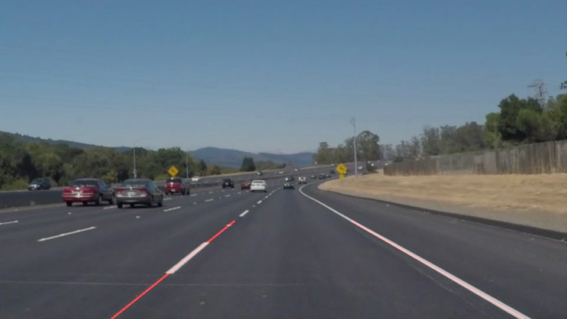

# Finding Lane Lines on the Road
A pipeline built with NumPy and cv2 to find lines in image / video on the road.

## Example input image

## Example output image

# How it works
The pipeline consists of 7 steps.

## Step 1: Transform the image into greyscale
Preparation for Canny edge extraction.

## Step 2: Gaussian blur the image
Preparation for Canny edge extraction.

## Step 3: Canny edge detection
The idea of Canny edge detection is to measure the intensity gradient of the image i.e. how much the image changes at this point. And we consider the points with high gradient as candidates for edges.

The Canny edge detection takes two parameters, low threshold and high threshold. We think the points with gradient greater than high threshold is strong line and discard points with gradient less than low threshold. For points between, we takes the ones connected to any strong line.

## Step 4: Window mask
We only concentrate on a part of image, where the lane line often appear to be.

## Step 5: Hough transform
Hough transform is a way to detect imperfect lines. We use it to extract straight lines from the result from Canny edge detection. The idea of it is to transform the data from x-y space to r-theta space. It will be easier to vote for imperfect lines.

## Step 6: Draw lines
The previous steps detect lines in the image. We will need to merge the dash lines in this step and draw them.

1. Divide the lines into left line and right line two groups.
2. Do linear regression to find the two average line for two groups.
3. Find the the length of lines you want to draw. I use the max-y and min-y of the points in current frame here.
4. Use the parameters find in step 2 and 3 to draw the two lines.

## Step 7: Merge images
Merge the image with lines to the original image.

# Potential shortcomings with the current pipeline

1. The window is fixed. It may not be the right windown when we are turning.
2. It draws lines frame by frame, so the lines shake a lot. It may make the car makes a lot of small turns. We may want to smooth the position of the the lines.
3. It only supports straight lines.
4. It classify the lines into two groups by checking if the slope is greater or smaller than zero. It will only be correct when we are going straight. 

# Possible improvements
1. Add non-straight line support.
2. Adjust window and classification algorithm according to the turning angle.
